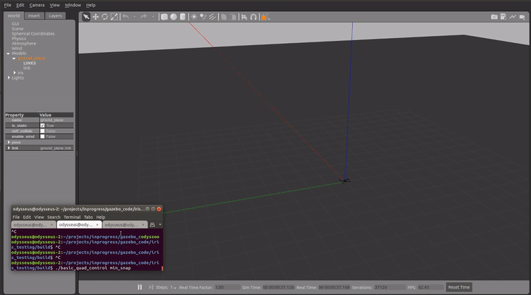

# quadcopter_simulation_gazebo
Includes a motor model that is applied to each motor in the iris sdf file. Publish->Subscribe communications.

How to build:
1) clone the repo
2) move the "iris_test" folder into "~/.gazebo/models/"; this is your vehicle model and world model
3) in "quadcopter_simulation_gazebo" run `mkdir build` and `cd build`
4) link your new libraries `export LD_LIBRARY_PATH=${LD_LIBRARY_PATH}:<full path to dir>/build`
5) from "build" run `cmake ../` then `make`
6) run the simulation from the build folder `gazebo --verbose ../iris_testing.world`
7) in a separate terminal run one of the following commands
	- `./basic_quad_control hover`; take-off and hover at 2m
	- `./basic_quad_control land`; land via open-loop. 
	- `./basic_quad_control steps`; take-off, hover, and execute a series of step responses
	- `./basic_quad_control min_snap`; take-off and fly an S-shaped trajectory generated via optimizing for minimum snap (smooth acceleration)
	- `./basic_quad_control circle`; take-off and fly a circling trajectory
	- `./basic_quad_control fig8`; take-off and fly a figure-8 trajectory

8) For analysis and visualization, move the file "test_data.txt" from "build" to the path "iris_platform_analysis/sim_test_data" and in "iris_platform_analysis" run `python3 pos_att_analysis.py`

